# Lambda Invocation Flow via API Gateway

## Complete API Gateway → Lambda Flow Diagram

```mermaid
graph TB
    %% Client Layer
    Client[👤 Client Application]
    
    %% API Gateway Layer
    APIGateway[🌐 API Gateway]
    
    %% Main Entry Points
    Client --> APIGateway
    APIGateway --> DocumentUpload[📄 Document Upload Flow]
    APIGateway --> ChatQuery[💬 Chat Query Flow]
    APIGateway --> CRUDOperations[🗄️ CRUD Operations Flow]
    
    %% Document Upload Flow
    subgraph "Document Upload Pipeline"
        DocumentUpload --> PresignedURL[📋 S3 Presigned URL]
        PresignedURL --> S3Upload[☁️ S3 Upload]
        S3Upload --> S3Event[S3 Event Trigger]
        S3Event --> DocumentProcessor[📄 document-processor-business-logic<br/>ZIP LAMBDA]
        
        DocumentProcessor --> DoclingCall[🔧 Call docling-library-handler<br/>DOCKER LAMBDA]
        DocumentProcessor --> SentenceTransformerCall[🧠 Call sentence-transformer-library-handler<br/>DOCKER LAMBDA]
        DocumentProcessor --> PineconeCall[🔍 Call pinecone-library-handler<br/>DOCKER LAMBDA]
        DocumentProcessor --> Neo4jCall[🕸️ Call neo4j-library-handler<br/>DOCKER LAMBDA]
        DocumentProcessor --> DynamoDBWrite[💾 Direct DynamoDB Write]
        DocumentProcessor --> S3Markdown[📝 Direct S3 Markdown Storage]
    end
    
    %% Chat Query Flow
    subgraph "Chat Query Pipeline"
        ChatQuery --> ChatOrchestrator[💬 chat-orchestrator-business-logic<br/>ZIP LAMBDA]
        
        ChatOrchestrator --> SentenceTransformerQuery[🧠 Call sentence-transformer-library-handler<br/>DOCKER LAMBDA]
        ChatOrchestrator --> PineconeSearch[🔍 Call pinecone-library-handler<br/>DOCKER LAMBDA]
        ChatOrchestrator --> Neo4jQuery[🕸️ Call neo4j-library-handler<br/>DOCKER LAMBDA]
        ChatOrchestrator --> DynamoDBQuery[💾 Direct DynamoDB Query]
        ChatOrchestrator --> OpenAICall[🤖 Call openai-library-handler<br/>DOCKER LAMBDA]
        
        OpenAICall --> ChatResponse[📤 Return Chat Response]
    end
    
    %% CRUD Operations Flow
    subgraph "CRUD Operations Pipeline"
        CRUDOperations --> DynamoDBCRUD[🗄️ dynamodb-crud-handler<br/>ZIP LAMBDA]
        CRUDOperations --> S3Operations[☁️ s3-unified-handler<br/>ZIP LAMBDA]
        
        DynamoDBCRUD --> DynamoDBDirect[💾 Direct DynamoDB Operations]
        S3Operations --> S3Direct[☁️ Direct S3 Operations]
    end
    
    %% Styling
    classDef zipLambda fill:#e1f5fe,stroke:#01579b,stroke-width:2px
    classDef dockerLambda fill:#f3e5f5,stroke:#4a148c,stroke-width:2px
    classDef storage fill:#e8f5e8,stroke:#1b5e20,stroke-width:2px
    classDef client fill:#fff3e0,stroke:#e65100,stroke-width:2px
    
    class DocumentProcessor,ChatOrchestrator,DynamoDBCRUD,S3Operations zipLambda
    class DoclingCall,SentenceTransformerCall,PineconeCall,Neo4jCall,SentenceTransformerQuery,PineconeSearch,Neo4jQuery,OpenAICall dockerLambda
    class DynamoDBWrite,S3Markdown,DynamoDBQuery,DynamoDBDirect,S3Direct storage
    class Client,APIGateway client
```



## API Gateway Endpoints Configuration

### 1. Document Upload Endpoints

| Method | Endpoint | Lambda Function | Purpose |
|--------|----------|-----------------|---------|
| `POST` | `/upload/presigned-url` | `s3-unified-handler` | Generate S3 presigned URL |
| `POST` | `/upload/complete` | `document-processor-business-logic` | Process uploaded document |

### 2. Chat Query Endpoints

| Method | Endpoint | Lambda Function | Purpose |
|--------|----------|-----------------|---------|
| `POST` | `/chat/query` | `chat-orchestrator-business-logic` | Process chat queries |
| `POST` | `/chat/history` | `chat-orchestrator-business-logic` | Get chat history |

### 3. CRUD Operations Endpoints

| Method | Endpoint | Lambda Function | Purpose |
|--------|----------|-----------------|---------|
| `GET` | `/documents` | `dynamodb-crud-handler` | List documents |
| `GET` | `/documents/{id}` | `dynamodb-crud-handler` | Get document details |
| `PUT` | `/documents/{id}` | `dynamodb-crud-handler` | Update document |
| `DELETE` | `/documents/{id}` | `dynamodb-crud-handler` | Delete document |
| `GET` | `/files` | `s3-unified-handler` | List S3 files |
| `GET` | `/files/{key}` | `s3-unified-handler` | Download file |

## Detailed Flow Descriptions

### 📄 Document Upload Flow

1. **Client** → **API Gateway** → **S3 Presigned URL**
   - Client requests presigned URL for document upload
   - `s3-unified-handler` (ZIP) generates presigned URL
   - Returns upload URL to client

2. **Client** → **S3 Upload**
   - Client uploads document directly to S3
   - S3 triggers event notification

3. **S3 Event** → **Document Processor**
   - S3 event triggers `document-processor-business-logic` (ZIP)
   - Downloads document from S3
   - Orchestrates processing pipeline

4. **Document Processor** → **Library Lambdas**
   - Calls `docling-library-handler` (DOCKER) for document processing
   - Calls `sentence-transformer-library-handler` (DOCKER) for embeddings
   - Calls `pinecone-library-handler` (DOCKER) for vector storage
   - Calls `neo4j-library-handler` (DOCKER) for graph relations

5. **Document Processor** → **Direct Storage**
   - Stores chunks to DynamoDB directly
   - Stores markdown to S3 directly

### 💬 Chat Query Flow

1. **Client** → **API Gateway** → **Chat Orchestrator**
   - Client sends chat query
   - `chat-orchestrator-business-logic` (ZIP) processes query

2. **Chat Orchestrator** → **Library Lambdas**
   - Calls `sentence-transformer-library-handler` (DOCKER) for query embedding
   - Calls `pinecone-library-handler` (DOCKER) for vector search
   - Calls `neo4j-library-handler` (DOCKER) for graph queries
   - Calls `openai-library-handler` (DOCKER) for response generation

3. **Chat Orchestrator** → **Direct Storage**
   - Queries DynamoDB directly for additional context

4. **Chat Orchestrator** → **Response**
   - Synthesizes response from all sources
   - Returns comprehensive answer to client

### 🗄️ CRUD Operations Flow

1. **Client** → **API Gateway** → **CRUD Handlers**
   - Client makes CRUD requests
   - Routes to appropriate handler

2. **DynamoDB CRUD**
   - `dynamodb-crud-handler` (ZIP) handles document metadata operations
   - Direct DynamoDB operations

3. **S3 Operations**
   - `s3-unified-handler` (ZIP) handles file operations
   - Direct S3 operations

## Key Benefits of This Architecture

✅ **API Gateway Integration**: Clean REST API endpoints  
✅ **Smart Routing**: Business logic in ZIP Lambdas, libraries in Docker Lambdas  
✅ **Direct Storage Access**: ZIP Lambdas can access DynamoDB and S3 directly  
✅ **Library Abstraction**: Heavy libraries isolated in Docker containers  
✅ **Comprehensive Logging**: All business logic visible and logged  
✅ **Scalable**: Each component can scale independently  

## Environment Variables Configuration

Business logic Lambdas are configured with environment variables to know which library functions to call:

```bash
DOCLING_LIBRARY_FUNCTION=docling-library-handler
PINECONE_LIBRARY_FUNCTION=pinecone-library-handler
NEO4J_LIBRARY_FUNCTION=neo4j-library-handler
OPENAI_LIBRARY_FUNCTION=openai-library-handler
SENTENCE_TRANSFORMER_LIBRARY_FUNCTION=sentence-transformer-library-handler
CHUNKS_TABLE=document-chunks
PROCESSED_DOCUMENTS_BUCKET=processed-documents
```

This architecture provides a clean separation between API Gateway routing, business logic (ZIP Lambdas), and heavy library operations (Docker Lambdas) while maintaining full visibility of your business logic in the AWS Lambda console.
