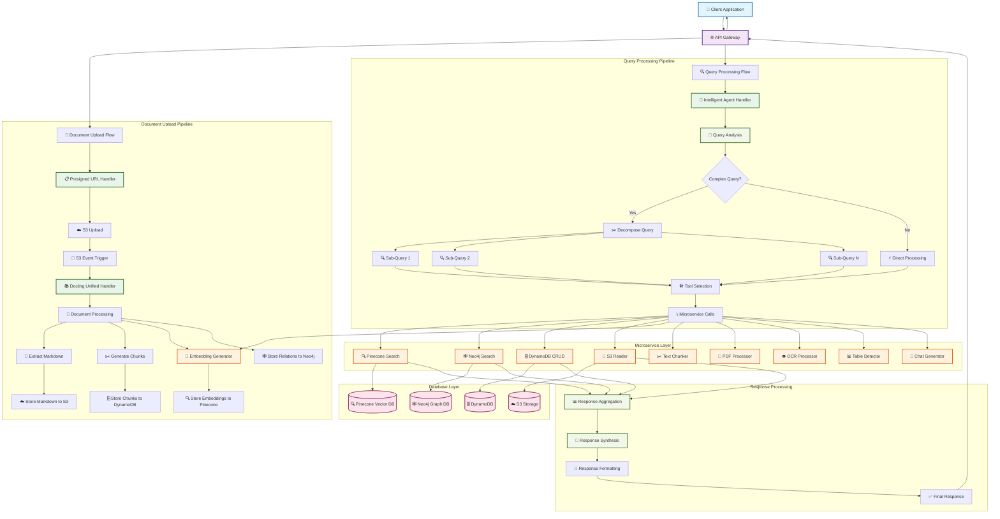
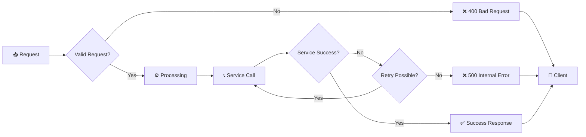
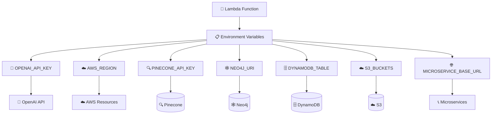

# KnowledgeBot Backend - Request Flow Architecture

## Complete Request Flow Diagram



## Detailed Component Flow

### 1. Document Upload Flow
```
Client Request → API Gateway → Presigned URL Handler → S3 Upload → S3 Event → Docling Unified Handler
```

**Docling Unified Handler Processing:**
1. **Document Processing**: Downloads from S3, processes with Docling
2. **Content Extraction**: Extracts markdown, generates chunks
3. **Embedding Generation**: Creates vector embeddings
4. **Storage Operations**:
   - Markdown → S3 (processed-documents bucket)
   - Chunks → DynamoDB (document-chunks table)
   - Embeddings → Pinecone (vector database)
   - Relations → Neo4j (graph database)

### 2. Query Processing Flow
```
Client Query → API Gateway → Intelligent Agent Handler → Query Analysis → Tool Selection → Microservice Calls → Response Synthesis
```

**Intelligent Agent Handler Processing:**
1. **Query Analysis**: Analyzes complexity and type
2. **Decomposition**: Breaks complex queries into sub-questions
3. **Tool Selection**: Chooses appropriate microservices
4. **Execution**: Calls microservices in optimal order
5. **Synthesis**: Combines results into coherent response

### 3. Microservice Communication Pattern
```
Intelligent Agent → HTTP POST → Microservice → Database Operation → JSON Response → Intelligent Agent
```

**Available Microservices:**
- **Pinecone Search/Upsert**: Vector similarity operations
- **Neo4j Search/Write**: Graph database operations  
- **DynamoDB CRUD**: Document metadata storage
- **S3 Reader**: Document content retrieval
- **Embedding Generator**: Text-to-vector conversion
- **Text Chunker**: Text segmentation
- **PDF Processor**: PDF content extraction
- **OCR Processor**: Image text recognition
- **Table Detector**: Table structure detection
- **Chat Generator**: Response generation

## Request Types and Routing

### Document Upload Request
```
POST /api/upload
Body: { filename, content_type }
→ Presigned URL Handler
→ Returns: { upload_url, document_id }
```

### Query Request
```
POST /api/query  
Body: { query, conversation_history }
→ Intelligent Agent Handler
→ Returns: { answer, sources, processing_details }
```

### Direct Microservice Calls
```
POST /api/{service}/{endpoint}
Body: { service_specific_payload }
→ Specific Microservice
→ Returns: { success, data, error }
```

## Error Handling Flow



## Environment Variables Flow



## Performance Optimization Points

1. **Parallel Processing**: Multiple microservice calls can run in parallel
2. **Caching**: Pinecone and DynamoDB provide built-in caching
3. **Async Operations**: All microservice calls are asynchronous
4. **Connection Pooling**: Database connections are pooled
5. **Lambda Cold Start**: Consider provisioned concurrency for critical functions

## Monitoring and Logging Points

1. **API Gateway**: Request/response logging
2. **Lambda Functions**: CloudWatch logs
3. **Database Operations**: Query performance metrics
4. **Microservice Calls**: HTTP response times
5. **Error Tracking**: Comprehensive error logging throughout

This architecture ensures scalability, maintainability, and high performance for your KnowledgeBot backend system.
