# KnowledgeBot Backend - Request Flow Architecture

## Complete Request Flow Diagram

```mermaid
graph TB
    %% Client Layer
    Client[👤 Client Application]
    
    %% API Gateway Layer
    APIGateway[🌐 API Gateway]
    
    %% Main Entry Points
    Client --> APIGateway
    APIGateway --> DocumentUpload[📄 Document Upload Flow]
    APIGateway --> QueryProcessing[🔍 Query Processing Flow]
    
    %% Document Upload Flow
    subgraph "Document Upload Pipeline"
        DocumentUpload --> PresignedURL[📋 Presigned URL Handler]
        PresignedURL --> S3Upload[☁️ S3 Upload]
        S3Upload --> S3Event[📡 S3 Event Trigger]
        S3Event --> DoclingHandler[📚 Docling Unified Handler]
        
        DoclingHandler --> DoclingProcess[🔧 Document Processing]
        DoclingProcess --> MarkdownExtract[📝 Extract Markdown]
        DoclingProcess --> ChunkGeneration[✂️ Generate Chunks]
        DoclingProcess --> EmbeddingGen[🧠 Generate Embeddings]
        
        MarkdownExtract --> S3Markdown[☁️ Store Markdown to S3]
        ChunkGeneration --> DynamoDBChunks[🗄️ Store Chunks to DynamoDB]
        EmbeddingGen --> PineconeStore[🔍 Store Embeddings to Pinecone]
        DoclingProcess --> Neo4jRelations[🕸️ Store Relations to Neo4j]
    end
    
    %% Query Processing Flow
    subgraph "Query Processing Pipeline"
        QueryProcessing --> IntelligentAgent[🤖 Intelligent Agent Handler]
        
        IntelligentAgent --> QueryAnalysis[🧠 Query Analysis]
        QueryAnalysis --> ComplexityCheck{Complex Query?}
        
        ComplexityCheck -->|Yes| QueryDecomposition[✂️ Decompose Query]
        ComplexityCheck -->|No| DirectProcessing[⚡ Direct Processing]
        
        QueryDecomposition --> SubQuery1[🔍 Sub-Query 1]
        QueryDecomposition --> SubQuery2[🔍 Sub-Query 2]
        QueryDecomposition --> SubQuery3[🔍 Sub-Query N]
        
        DirectProcessing --> ToolSelection[🛠️ Tool Selection]
        SubQuery1 --> ToolSelection
        SubQuery2 --> ToolSelection
        SubQuery3 --> ToolSelection
        
        ToolSelection --> MicroserviceCalls[📞 Microservice Calls]
    end
    
    %% Microservice Layer
    subgraph "Microservice Layer"
        MicroserviceCalls --> PineconeSearch[🔍 Pinecone Search]
        MicroserviceCalls --> Neo4jSearch[🕸️ Neo4j Search]
        MicroserviceCalls --> DynamoDBCRUD[🗄️ DynamoDB CRUD]
        MicroserviceCalls --> S3Reader[📖 S3 Reader]
        MicroserviceCalls --> EmbeddingGen[🧠 Embedding Generator]
        MicroserviceCalls --> TextChunker[✂️ Text Chunker]
        MicroserviceCalls --> PDFProcessor[📄 PDF Processor]
        MicroserviceCalls --> OCRProcessor[👁️ OCR Processor]
        MicroserviceCalls --> TableDetector[📊 Table Detector]
        MicroserviceCalls --> ChatGenerator[💬 Chat Generator]
    end
    
    %% Database Layer
    subgraph "Database Layer"
        PineconeSearch --> PineconeDB[(🔍 Pinecone Vector DB)]
        Neo4jSearch --> Neo4jDB[(🕸️ Neo4j Graph DB)]
        DynamoDBCRUD --> DynamoDB[(🗄️ DynamoDB)]
        S3Reader --> S3Storage[(☁️ S3 Storage)]
    end
    
    %% Response Processing
    subgraph "Response Processing"
        PineconeSearch --> ResponseAggregation[📊 Response Aggregation]
        Neo4jSearch --> ResponseAggregation
        DynamoDBCRUD --> ResponseAggregation
        S3Reader --> ResponseAggregation
        
        ResponseAggregation --> ResponseSynthesis[🧠 Response Synthesis]
        ResponseSynthesis --> ResponseFormatting[📝 Response Formatting]
        ResponseFormatting --> FinalResponse[✅ Final Response]
    end
    
    %% Return to Client
    FinalResponse --> APIGateway
    APIGateway --> Client
    
    %% Styling
    classDef clientClass fill:#e1f5fe,stroke:#01579b,stroke-width:2px
    classDef apiClass fill:#f3e5f5,stroke:#4a148c,stroke-width:2px
    classDef handlerClass fill:#e8f5e8,stroke:#1b5e20,stroke-width:2px
    classDef microserviceClass fill:#fff3e0,stroke:#e65100,stroke-width:2px
    classDef databaseClass fill:#fce4ec,stroke:#880e4f,stroke-width:2px
    classDef processingClass fill:#f1f8e9,stroke:#33691e,stroke-width:2px
    
    class Client clientClass
    class APIGateway apiClass
    class IntelligentAgent,DoclingHandler,PresignedURL handlerClass
    class PineconeSearch,Neo4jSearch,DynamoDBCRUD,S3Reader,EmbeddingGen,TextChunker,PDFProcessor,OCRProcessor,TableDetector,ChatGenerator microserviceClass
    class PineconeDB,Neo4jDB,DynamoDB,S3Storage databaseClass
    class QueryAnalysis,ResponseAggregation,ResponseSynthesis processingClass
```



## Detailed Component Flow

### 1. Document Upload Flow
```
Client Request → API Gateway → Presigned URL Handler → S3 Upload → S3 Event → Docling Unified Handler
```

**Docling Unified Handler Processing:**
1. **Document Processing**: Downloads from S3, processes with Docling
2. **Content Extraction**: Extracts markdown, generates chunks
3. **Embedding Generation**: Creates vector embeddings
4. **Storage Operations**:
   - Markdown → S3 (processed-documents bucket)
   - Chunks → DynamoDB (document-chunks table)
   - Embeddings → Pinecone (vector database)
   - Relations → Neo4j (graph database)

### 2. Query Processing Flow
```
Client Query → API Gateway → Intelligent Agent Handler → Query Analysis → Tool Selection → Microservice Calls → Response Synthesis
```

**Intelligent Agent Handler Processing:**
1. **Query Analysis**: Analyzes complexity and type
2. **Decomposition**: Breaks complex queries into sub-questions
3. **Tool Selection**: Chooses appropriate microservices
4. **Execution**: Calls microservices in optimal order
5. **Synthesis**: Combines results into coherent response

### 3. Microservice Communication Pattern
```
Intelligent Agent → HTTP POST → Microservice → Database Operation → JSON Response → Intelligent Agent
```

**Available Microservices:**
- **Pinecone Search/Upsert**: Vector similarity operations
- **Neo4j Search/Write**: Graph database operations  
- **DynamoDB CRUD**: Document metadata storage
- **S3 Reader**: Document content retrieval
- **Embedding Generator**: Text-to-vector conversion
- **Text Chunker**: Text segmentation
- **PDF Processor**: PDF content extraction
- **OCR Processor**: Image text recognition
- **Table Detector**: Table structure detection
- **Chat Generator**: Response generation

## Request Types and Routing

### Document Upload Request
```
POST /api/upload
Body: { filename, content_type }
→ Presigned URL Handler
→ Returns: { upload_url, document_id }
```

### Query Request
```
POST /api/query  
Body: { query, conversation_history }
→ Intelligent Agent Handler
→ Returns: { answer, sources, processing_details }
```

### Direct Microservice Calls
```
POST /api/{service}/{endpoint}
Body: { service_specific_payload }
→ Specific Microservice
→ Returns: { success, data, error }
```

## Error Handling Flow

```mermaid
graph LR
    Request[📥 Request] --> Validation{Valid Request?}
    Validation -->|No| Error400[❌ 400 Bad Request]
    Validation -->|Yes| Processing[⚙️ Processing]
    
    Processing --> ServiceCall[📞 Service Call]
    ServiceCall --> ServiceResponse{Service Success?}
    
    ServiceResponse -->|No| Retry{Retry Possible?}
    ServiceResponse -->|Yes| Success[✅ Success Response]
    
    Retry -->|Yes| ServiceCall
    Retry -->|No| Error500[❌ 500 Internal Error]
    
    Error400 --> Client[👤 Client]
    Error500 --> Client
    Success --> Client
```



## Environment Variables Flow

```mermaid
graph TB
    Lambda[🔧 Lambda Function] --> EnvVars[📋 Environment Variables]
    
    EnvVars --> OpenAI[🔑 OPENAI_API_KEY]
    EnvVars --> AWS[☁️ AWS_REGION]
    EnvVars --> Pinecone[🔍 PINECONE_API_KEY]
    EnvVars --> Neo4j[🕸️ NEO4J_URI]
    EnvVars --> DynamoDB[🗄️ DYNAMODB_TABLE]
    EnvVars --> S3[☁️ S3_BUCKETS]
    EnvVars --> MicroserviceURL[🌐 MICROSERVICE_BASE_URL]
    
    OpenAI --> OpenAIAPI[🤖 OpenAI API]
    AWS --> AWSResources[☁️ AWS Resources]
    Pinecone --> PineconeDB[(🔍 Pinecone)]
    Neo4j --> Neo4jDB[(🕸️ Neo4j)]
    DynamoDB --> DynamoDBTable[(🗄️ DynamoDB)]
    S3 --> S3Buckets[(☁️ S3)]
    MicroserviceURL --> Microservices[📞 Microservices]
```



## Performance Optimization Points

1. **Parallel Processing**: Multiple microservice calls can run in parallel
2. **Caching**: Pinecone and DynamoDB provide built-in caching
3. **Async Operations**: All microservice calls are asynchronous
4. **Connection Pooling**: Database connections are pooled
5. **Lambda Cold Start**: Consider provisioned concurrency for critical functions

## Monitoring and Logging Points

1. **API Gateway**: Request/response logging
2. **Lambda Functions**: CloudWatch logs
3. **Database Operations**: Query performance metrics
4. **Microservice Calls**: HTTP response times
5. **Error Tracking**: Comprehensive error logging throughout

This architecture ensures scalability, maintainability, and high performance for your KnowledgeBot backend system.
