# Lambda Inter-Service Communication Flow

## Complete Request Flow with File Interactions

```mermaid
graph TB
    %% Client and API Gateway
    Client[👤 Client Application]
    APIGateway[🌐 API Gateway]
    
    %% Main Entry Points
    Client --> APIGateway
    APIGateway --> DocumentUpload[📄 Document Upload Request]
    APIGateway --> ChatQuery[💬 Chat Query Request]
    APIGateway --> CRUDRequest[🗄️ CRUD Request]
    
    %% Document Upload Flow
    subgraph "Document Upload Pipeline"
        DocumentUpload --> S3Handler[📋 s3-unified-handler.py<br/>ZIP LAMBDA]
        S3Handler --> PresignedURL[Generate Presigned URL]
        PresignedURL --> S3Upload[☁️ S3 Upload]
        S3Upload --> S3Event[S3 Event Trigger]
        S3Event --> DocumentProcessor[📄 document-processor-business-logic.py<br/>ZIP LAMBDA]
        
        %% Document Processor calls Library Lambdas
        DocumentProcessor --> DoclingCall[🔧 docling-library-handler.py<br/>DOCKER LAMBDA]
        DocumentProcessor --> SentenceTransformerCall[🧠 sentence-transformer-library-handler.py<br/>DOCKER LAMBDA]
        DocumentProcessor --> PineconeCall[🔍 pinecone-library-handler.py<br/>DOCKER LAMBDA]
        DocumentProcessor --> Neo4jCall[🕸️ neo4j-library-handler.py<br/>DOCKER LAMBDA]
        
        %% Document Processor direct operations
        DocumentProcessor --> DynamoDBWrite[💾 Direct DynamoDB Write]
        DocumentProcessor --> S3Markdown[📝 Direct S3 Markdown Storage]
    end
    
    %% Chat Query Flow
    subgraph "Chat Query Pipeline"
        ChatQuery --> ChatOrchestrator[💬 chat-orchestrator-business-logic.py<br/>ZIP LAMBDA]
        
        %% Chat Orchestrator calls Library Lambdas
        ChatOrchestrator --> SentenceTransformerQuery[🧠 sentence-transformer-library-handler.py<br/>DOCKER LAMBDA]
        ChatOrchestrator --> PineconeSearch[🔍 pinecone-library-handler.py<br/>DOCKER LAMBDA]
        ChatOrchestrator --> Neo4jQuery[🕸️ neo4j-library-handler.py<br/>DOCKER LAMBDA]
        ChatOrchestrator --> OpenAICall[🤖 openai-library-handler.py<br/>DOCKER LAMBDA]
        
        %% Chat Orchestrator direct operations
        ChatOrchestrator --> DynamoDBQuery[💾 Direct DynamoDB Query]
        
        OpenAICall --> ChatResponse[📤 Return Chat Response]
    end
    
    %% CRUD Operations Flow
    subgraph "CRUD Operations Pipeline"
        CRUDRequest --> DynamoDBCRUD[🗄️ dynamodb-crud-handler.py<br/>ZIP LAMBDA]
        CRUDRequest --> S3Operations[☁️ s3-unified-handler.py<br/>ZIP LAMBDA]
        
        DynamoDBCRUD --> DynamoDBDirect[💾 Direct DynamoDB Operations]
        S3Operations --> S3Direct[☁️ Direct S3 Operations]
    end
    
    %% Styling
    classDef zipLambda fill:#e1f5fe,stroke:#01579b,stroke-width:3px
    classDef dockerLambda fill:#f3e5f5,stroke:#4a148c,stroke-width:3px
    classDef storage fill:#e8f5e8,stroke:#1b5e20,stroke-width:2px
    classDef client fill:#fff3e0,stroke:#e65100,stroke-width:2px
    
    class DocumentProcessor,ChatOrchestrator,DynamoDBCRUD,S3Handler zipLambda
    class DoclingCall,SentenceTransformerCall,PineconeCall,Neo4jCall,SentenceTransformerQuery,PineconeSearch,Neo4jQuery,OpenAICall dockerLambda
    class DynamoDBWrite,S3Markdown,DynamoDBQuery,DynamoDBDirect,S3Direct storage
    class Client,APIGateway client
```



## Detailed File-to-File Communication

### 📄 Document Upload Request Flow

#### 1. **Client → API Gateway → s3-unified-handler.py**
```python
# Client makes POST request to /upload/presigned-url
POST /upload/presigned-url
{
    "filename": "document.pdf",
    "content_type": "application/pdf"
}

# s3-unified-handler.py processes:
def lambda_handler(event, context):
    # Extract filename from request body
    body = json.loads(event.get('body', '{}'))
    filename = body.get('filename', 'document.pdf')
    
    # Generate presigned URL
    return generate_presigned_url(filename, content_type)
```

#### 2. **Client → S3 Upload (Direct)**
```python
# Client uploads directly to S3 using presigned URL
# No Lambda involved - direct S3 operation
```

#### 3. **S3 Event → document-processor-business-logic.py**
```python
# S3 triggers document-processor-business-logic.py
def lambda_handler(event, context):
    # Process S3 event
    for record in event['Records']:
        bucket = record['s3']['bucket']['name']
        key = record['s3']['object']['key']
        
        # Download document from S3
        document_bytes = download_from_s3(bucket, key)
        
        # Call Docling library Lambda
        docling_result = call_docling_library(document_bytes)
        
        # Call Sentence Transformer library Lambda
        embeddings = call_sentence_transformer_library(docling_result['chunks'])
        
        # Call Pinecone library Lambda
        call_pinecone_library(embeddings)
        
        # Call Neo4j library Lambda
        call_neo4j_library(docling_result['entities'])
        
        # Direct operations
        store_chunks_to_dynamodb(docling_result['chunks'])
        store_markdown_to_s3(docling_result['markdown'])
```

#### 4. **document-processor-business-logic.py → Library Lambdas**

**Calling docling-library-handler.py:**
```python
def call_docling_library(document_bytes):
    """Call Docling library Lambda"""
    lambda_client = boto3.client('lambda')
    
    response = lambda_client.invoke(
        FunctionName='docling-library-handler',
        InvocationType='RequestResponse',
        Payload=json.dumps({
            'document_bytes': base64.b64encode(document_bytes).decode(),
            'operation': 'process_document'
        })
    )
    
    result = json.loads(response['Payload'].read())
    return result
```

**Calling sentence-transformer-library-handler.py:**
```python
def call_sentence_transformer_library(chunks):
    """Call Sentence Transformer library Lambda"""
    lambda_client = boto3.client('lambda')
    
    response = lambda_client.invoke(
        FunctionName='sentence-transformer-library-handler',
        InvocationType='RequestResponse',
        Payload=json.dumps({
            'texts': chunks,
            'operation': 'generate_embeddings'
        })
    )
    
    result = json.loads(response['Payload'].read())
    return result['embeddings']
```

**Calling pinecone-library-handler.py:**
```python
def call_pinecone_library(embeddings):
    """Call Pinecone library Lambda"""
    lambda_client = boto3.client('lambda')
    
    response = lambda_client.invoke(
        FunctionName='pinecone-library-handler',
        InvocationType='RequestResponse',
        Payload=json.dumps({
            'vectors': embeddings,
            'operation': 'upsert_vectors'
        })
    )
    
    return json.loads(response['Payload'].read())
```

**Calling neo4j-library-handler.py:**
```python
def call_neo4j_library(entities):
    """Call Neo4j library Lambda"""
    lambda_client = boto3.client('lambda')
    
    response = lambda_client.invoke(
        FunctionName='neo4j-library-handler',
        InvocationType='RequestResponse',
        Payload=json.dumps({
            'entities': entities,
            'operation': 'create_relationships'
        })
    )
    
    return json.loads(response['Payload'].read())
```

### 💬 Chat Query Request Flow

#### 1. **Client → API Gateway → chat-orchestrator-business-logic.py**
```python
# Client makes POST request to /chat/query
POST /chat/query
{
    "query": "What is machine learning?",
    "conversation_id": "conv_123"
}

# chat-orchestrator-business-logic.py processes:
def lambda_handler(event, context):
    # Extract query from request
    body = json.loads(event.get('body', '{}'))
    query = body.get('query', '')
    
    # Call Sentence Transformer for query embedding
    query_embedding = call_sentence_transformer_library([query])
    
    # Call Pinecone for vector search
    search_results = call_pinecone_library({
        'operation': 'search',
        'vector': query_embedding[0],
        'top_k': 5
    })
    
    # Call Neo4j for graph queries
    graph_context = call_neo4j_library({
        'operation': 'query',
        'cypher': f"MATCH (n) WHERE n.text CONTAINS '{query}' RETURN n"
    })
    
    # Query DynamoDB for additional context
    db_context = query_dynamodb_for_context(query)
    
    # Call OpenAI for response generation
    response = call_openai_library({
        'query': query,
        'context': search_results + graph_context + db_context
    })
    
    return response
```

#### 2. **chat-orchestrator-business-logic.py → Library Lambdas**

**Calling sentence-transformer-library-handler.py:**
```python
def call_sentence_transformer_library(texts):
    """Call Sentence Transformer library Lambda"""
    lambda_client = boto3.client('lambda')
    
    response = lambda_client.invoke(
        FunctionName='sentence-transformer-library-handler',
        InvocationType='RequestResponse',
        Payload=json.dumps({
            'texts': texts,
            'operation': 'generate_embeddings'
        })
    )
    
    result = json.loads(response['Payload'].read())
    return result['embeddings']
```

**Calling pinecone-library-handler.py:**
```python
def call_pinecone_library(search_params):
    """Call Pinecone library Lambda"""
    lambda_client = boto3.client('lambda')
    
    response = lambda_client.invoke(
        FunctionName='pinecone-library-handler',
        InvocationType='RequestResponse',
        Payload=json.dumps(search_params)
    )
    
    return json.loads(response['Payload'].read())
```

**Calling neo4j-library-handler.py:**
```python
def call_neo4j_library(query_params):
    """Call Neo4j library Lambda"""
    lambda_client = boto3.client('lambda')
    
    response = lambda_client.invoke(
        FunctionName='neo4j-library-handler',
        InvocationType='RequestResponse',
        Payload=json.dumps(query_params)
    )
    
    return json.loads(response['Payload'].read())
```

**Calling openai-library-handler.py:**
```python
def call_openai_library(chat_params):
    """Call OpenAI library Lambda"""
    lambda_client = boto3.client('lambda')
    
    response = lambda_client.invoke(
        FunctionName='openai-library-handler',
        InvocationType='RequestResponse',
        Payload=json.dumps(chat_params)
    )
    
    return json.loads(response['Payload'].read())
```

### 🗄️ CRUD Request Flow

#### 1. **Client → API Gateway → dynamodb-crud-handler.py**
```python
# Client makes GET request to /documents
GET /documents

# dynamodb-crud-handler.py processes:
def lambda_handler(event, context):
    # Extract HTTP method and path
    http_method = event.get('httpMethod', 'GET')
    path = event.get('path', '')
    
    if http_method == 'GET' and '/documents' in path:
        # Direct DynamoDB operation
        return list_documents()
    elif http_method == 'POST' and '/documents' in path:
        return create_document(json.loads(event.get('body', '{}')))
    # ... other CRUD operations
```

#### 2. **Client → API Gateway → s3-unified-handler.py**
```python
# Client makes GET request to /files
GET /files?bucket=my-bucket&prefix=documents/

# s3-unified-handler.py processes:
def lambda_handler(event, context):
    # Extract query parameters
    query_parameters = event.get('queryStringParameters') or {}
    bucket = query_parameters.get('bucket')
    prefix = query_parameters.get('prefix', '')
    
    # Direct S3 operation
    return list_files(bucket, prefix)
```

## Key Communication Patterns

### 🔄 **Synchronous Invocation Pattern**
```python
# Business Logic Lambda calls Library Lambda
lambda_client = boto3.client('lambda')
response = lambda_client.invoke(
    FunctionName='library-handler-name',
    InvocationType='RequestResponse',  # Synchronous
    Payload=json.dumps(payload)
)
result = json.loads(response['Payload'].read())
```

### 📡 **Event-Driven Pattern**
```python
# S3 event triggers document processing
# S3 → document-processor-business-logic.py
# No direct invocation, triggered by AWS event
```

### 💾 **Direct Storage Access**
```python
# Business Logic Lambdas access storage directly
dynamodb = boto3.resource('dynamodb')
table = dynamodb.Table('document-chunks')
table.put_item(Item=chunk_data)

s3_client = boto3.client('s3')
s3_client.put_object(Bucket=bucket, Key=key, Body=content)
```

## Environment Variables for Service Discovery

Business Logic Lambdas are configured with environment variables to know which Library Lambdas to call:

```bash
# In document-processor-business-logic.py and chat-orchestrator-business-logic.py
DOCLING_LIBRARY_FUNCTION=docling-library-handler
PINECONE_LIBRARY_FUNCTION=pinecone-library-handler
NEO4J_LIBRARY_FUNCTION=neo4j-library-handler
OPENAI_LIBRARY_FUNCTION=openai-library-handler
SENTENCE_TRANSFORMER_LIBRARY_FUNCTION=sentence-transformer-library-handler
```

This architecture ensures that:
- **Business Logic** is always in ZIP Lambdas (viewable in console)
- **Heavy Libraries** are isolated in Docker Lambdas
- **Direct Storage Access** is available for performance
- **Service Discovery** is handled via environment variables
- **Error Handling** is comprehensive at each layer
