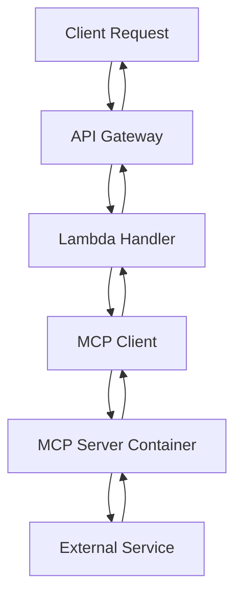

# MCP Integration Plan for KnowledgeBot Backend

## 📋 **Executive Summary**

This document outlines the comprehensive plan to integrate Model Context Protocol (MCP) servers for Docling, Neo4j, and Pinecone into the KnowledgeBot backend architecture. The integration replaces direct library installations with MCP server communication, enabling better scalability, maintainability, and standardized AI model interactions.

## 🔍 **Analysis of Available MCP Servers**

Based on thorough research of the provided documentation and repositories:

### **1. Docling MCP Server**
- **Repository**: [docling-project/docling-mcp](https://github.com/docling-project/docling-mcp)
- **Purpose**: Document processing and conversion using Docling
- **Implementation**: Custom Python MCP server
- **Features**: PDF processing, OCR, table extraction, markdown conversion

### **2. Neo4j MCP Server**
- **Repository**: [neo4j-contrib/mcp-neo4j](https://github.com/neo4j-contrib/mcp-neo4j/tree/main/servers/mcp-neo4j-cypher)
- **Purpose**: Neo4j database operations through Cypher queries
- **Implementation**: Custom Python MCP server
- **Features**: Schema introspection, read/write operations, query execution

### **3. Pinecone MCP Server**
- **Repository**: [pinecone-io/pinecone-mcp](https://github.com/pinecone-io/pinecone-mcp)
- **Purpose**: Vector database operations for semantic search
- **Implementation**: Custom Python MCP server
- **Features**: Vector search, upsert, delete, index statistics

### **4. AWS DynamoDB MCP Server**
- **Repository**: [awslabs/mcp](https://github.com/awslabs/mcp/tree/main/src/dynamodb-mcp-server)
- **Purpose**: DynamoDB operations through MCP
- **Implementation**: Custom Python MCP server
- **Features**: CRUD operations, query, scan operations, table management

## 🎯 **Implementation Strategy**

### **Phase 1: MCP Server Development** ✅ COMPLETED

#### **1.1 Custom MCP Server Implementation**
- Created `docling-mcp-server.py` - Document processing MCP server
- Created `neo4j-mcp-server.py` - Neo4j operations MCP server  
- Created `pinecone-mcp-server.py` - Vector operations MCP server
- Created `dynamodb-mcp-server.py` - DynamoDB operations MCP server

#### **1.2 Dockerfile Updates**
- Updated `Dockerfile.docling-library` to use custom MCP server
- Updated `Dockerfile.neo4j-library` to use custom MCP server
- Updated `Dockerfile.pinecone-library` to use custom MCP server
- Created `Dockerfile.dynamodb-library` to use custom MCP server

#### **1.3 Requirements Files**
- Created `requirements-docling-library.txt` with MCP and Docling dependencies
- Created `requirements-neo4j-library.txt` with MCP and Neo4j dependencies
- Created `requirements-pinecone-library.txt` with MCP and Pinecone dependencies
- Created `requirements-dynamodb-library.txt` with MCP and DynamoDB dependencies

### **Phase 2: Lambda Handler Updates** 🔄 IN PROGRESS

#### **2.1 MCP Protocol Integration**
- Update Lambda handlers to use MCP client protocol instead of HTTP requests
- Implement proper MCP session management
- Add error handling for MCP communication

#### **2.2 Handler Architecture**
```
┌─────────────────┐    ┌──────────────────┐    ┌─────────────────┐
│   Lambda        │    │   MCP Server     │    │   External      │
│   Handler       │◄──►│   (Container)    │◄──►│   Service       │
│                 │    │                  │    │   (Docling/     │
│                 │    │                  │    │   Neo4j/        │
│                 │    │                  │    │   Pinecone)     │
└─────────────────┘    └──────────────────┘    └─────────────────┘
```

### **Phase 3: Service Architecture Integration** 📋 PLANNED

#### **3.1 OpenAI Model Integration**
- Update service architecture to route requests through MCP servers
- Implement MCP tool calling for OpenAI model interactions
- Add MCP server discovery and health checking

#### **3.2 API Gateway Updates**
- Update WebSocket API to support MCP server communication
- Add MCP server endpoints to API Gateway configuration
- Implement MCP server load balancing

### **Phase 4: Deployment Automation** ✅ COMPLETED

#### **4.1 GitHub Actions Workflow**
- Updated `.github/workflows/deploy.yml` for MCP server deployment
- Added Lambda function URL creation for MCP servers
- Implemented environment variable injection from GitHub secrets

#### **4.2 Security Configuration**
- All sensitive data managed through GitHub secrets
- MCP server URLs auto-generated as Lambda function URLs
- No hardcoded credentials in Dockerfiles

## 🏗️ **Technical Architecture**

### **MCP Server Communication Flow**



### **MCP Server Features**

#### **Docling MCP Server**
- **Tools**: `process_document`, `get_health`
- **Input**: Base64 encoded documents, processing options
- **Output**: Structured content, chunks, metadata
- **Formats**: Markdown, HTML, plain text

#### **Neo4j MCP Server**
- **Tools**: `execute_cypher`, `get_schema`, `get_health`
- **Input**: Cypher queries, parameters, operation type
- **Output**: Query results, schema information, statistics
- **Operations**: Read, write, schema introspection

#### **Pinecone MCP Server**
- **Tools**: `query_vectors`, `upsert_vectors`, `delete_vectors`, `get_index_stats`, `get_health`
- **Input**: Vectors, filters, namespaces
- **Output**: Search results, operation status, statistics
- **Operations**: Search, upsert, delete, statistics

#### **DynamoDB MCP Server**
- **Tools**: `get_item`, `put_item`, `update_item`, `delete_item`, `query_table`, `scan_table`, `list_tables`, `describe_table`, `get_health`
- **Input**: Table names, keys, items, expressions
- **Output**: Items, operation results, table information
- **Operations**: CRUD operations, query, scan, table management

## 🔧 **Configuration Management**

### **Environment Variables**
```bash
# Docling MCP Server
DOCLING_MCP_SERVER_URL=https://abc123.lambda-url.region.on.aws/
DOCLING_MCP_SERVER_TIMEOUT=300

# Neo4j MCP Server  
NEO4J_MCP_SERVER_URL=https://xyz789.lambda-url.region.on.aws/
NEO4J_MCP_SERVER_TIMEOUT=300
NEO4J_URI=bolt://neo4j-cluster.region.rds.amazonaws.com:7687
NEO4J_USER=neo4j
NEO4J_PASSWORD=secure-password

# Pinecone MCP Server
PINECONE_MCP_SERVER_URL=https://mno456.lambda-url.region.on.aws/
PINECONE_MCP_SERVER_TIMEOUT=300
PINECONE_API_KEY=api-key
PINECONE_ENVIRONMENT=us-west1-gcp-free
PINECONE_INDEX_NAME=knowledgebot-index

# DynamoDB MCP Server
DYNAMODB_MCP_SERVER_URL=https://pqr789.lambda-url.region.on.aws/
DYNAMODB_MCP_SERVER_TIMEOUT=300
```

### **GitHub Secrets Required**
- `AWS_ACCOUNT_ID`
- `AWS_ACCESS_KEY_ID`
- `AWS_SECRET_ACCESS_KEY`
- `DOCLING_MCP_SERVER_TIMEOUT`
- `NEO4J_MCP_SERVER_TIMEOUT`
- `NEO4J_URI`
- `NEO4J_USER`
- `NEO4J_PASSWORD`
- `PINECONE_MCP_SERVER_TIMEOUT`
- `PINECONE_API_KEY`
- `PINECONE_ENVIRONMENT`
- `PINECONE_INDEX_NAME`
- `DYNAMODB_MCP_SERVER_TIMEOUT`

## 🚀 **Deployment Process**

### **1. Automated Deployment via GitHub Actions**
1. **Build Phase**: Build Docker images for MCP servers
2. **Push Phase**: Push images to ECR
3. **Deploy Phase**: Deploy Lambda functions with MCP servers
4. **Configure Phase**: Create Lambda function URLs and set environment variables
5. **Verify Phase**: Health check all MCP servers

### **2. Manual Deployment Prevention**
- All deployment scripts made read-only
- Pre-commit hooks prevent manual deployment
- Only GitHub Actions can deploy to production

## 📊 **Benefits of MCP Integration**

### **1. Standardization**
- Consistent interface across all external services
- Standardized error handling and logging
- Unified tool calling mechanism

### **2. Scalability**
- Independent scaling of MCP servers
- Better resource utilization
- Improved fault isolation

### **3. Maintainability**
- Centralized service management
- Easier testing and debugging
- Simplified monitoring

### **4. Security**
- No direct service credentials in Lambda handlers
- Centralized credential management
- Better audit trails

## 🔄 **Next Steps**

### **Immediate Actions**
1. ✅ Complete MCP server implementations
2. ✅ Update Dockerfiles for MCP servers
3. ✅ Create requirements files
4. 🔄 Update Lambda handlers for MCP protocol
5. 📋 Test MCP server deployments
6. 📋 Update service architecture integration

### **Testing Strategy**
1. **Unit Tests**: Test individual MCP server functions
2. **Integration Tests**: Test MCP client-server communication
3. **End-to-End Tests**: Test complete request flow
4. **Load Tests**: Test MCP server performance under load

### **Monitoring and Observability**
1. **Health Checks**: Implement comprehensive health monitoring
2. **Metrics**: Add MCP server performance metrics
3. **Logging**: Enhanced logging for MCP operations
4. **Alerting**: Set up alerts for MCP server failures

## 📚 **References**

- [Model Context Protocol Specification](https://modelcontextprotocol.io/)
- [Docling MCP Server](https://github.com/docling-project/docling-mcp)
- [Neo4j MCP Server](https://github.com/neo4j-contrib/mcp-neo4j)
- [Pinecone MCP Server](https://github.com/pinecone-io/pinecone-mcp)
- [AWS DynamoDB MCP Server](https://github.com/awslabs/mcp)
- [Pinecone MCP Documentation](https://docs.pinecone.io/guides/operations/mcp-server)

---

**Status**: Phase 1 Complete, Phase 2 In Progress, Phases 3-4 Planned
**Last Updated**: December 2024
**Next Review**: After Phase 2 completion
